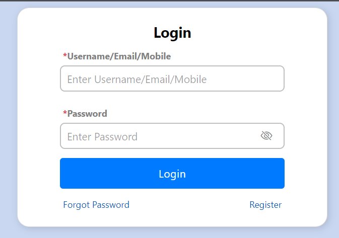
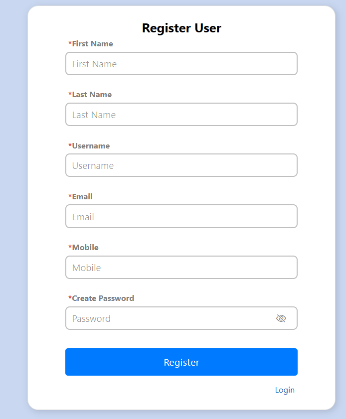
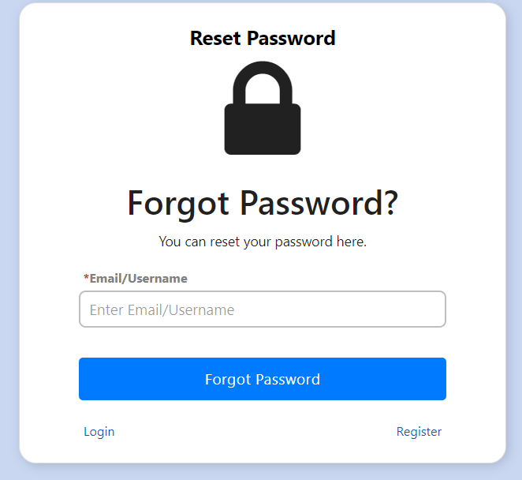
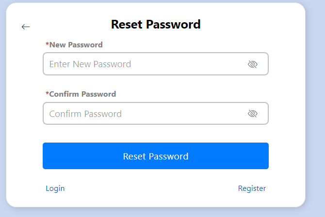
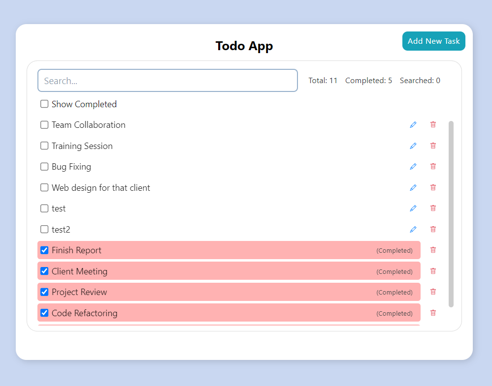
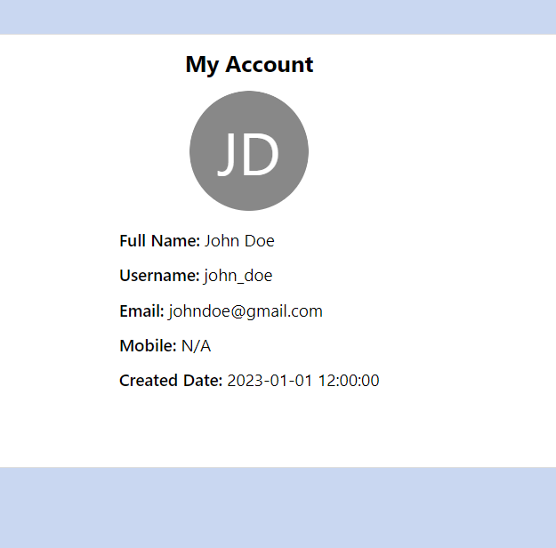

# Todo Project

This repository contains a simple Todo application with a ReactJS frontend, Node.js, and ExpressJS backend, and MySQL database.

# Frontend

### Pages

1. Login Page
2. Signup Page
3. Reset Password Page
4. Todo Page:
    - Displays and manages tasks from the database
      User Account Page: Displays user account information
      Essential Files

#### AppConfig.js:

Configuration data, including project name, route URLs, and data request URLs.

#### AppUtils.js:

Contains frontend-specific utility functions and request methods.

#### trident-ui Library:

Reusable components such as buttons, searchable lists, scroll views, images, loaders, avatars, etc.

#### App.jsx:

Contains route definitions for both after-login and without-login routes.

### How to Run Frontend

1. Install Node.js and npm.

   `npm i --legacy-peer-deps` ('--legacy-peer-deps' is optional)
2. Navigate to the frontend directory.
3. Run npm install to install dependencies.
4. Run npm start to start the development server.
5. Open the browser and visit http://localhost:3000.

## Backend

### server.js

Handles sessions and all requests.

### ServerConfig.js

Server configuration are stored in it (similar to frontend's AppConfig.js).

### ServerUtils.js

Contains database fetching and updating functions like add/updating user, reset-password, add/update/delete tasks etc.

### DbConn.js

Contains database connection setup.

### .env

Database credentials and other backend data stored in .env file.

## How to Run Backend

1. Install Node.js and npm.
2. Set up a MySQL server (e.g., **XAMPP**) and create a database named **this-is-db-name**.
3. Create a .env file with the following content:
    - DB_HOST=db-host
    - DB_USER=db_user
    - DB_PASSWORD=db-password
    - DB_DATABASE=this-is-db-name
    - SESSION_SECRET=my-secret-key

Navigate to the backend directory.

4. Run npm install to install dependencies.

   `npm i --legacy-peer-deps` ('--legacy-peer-deps' is optional)

###### Now the server will run on http://localhost:8010.

## Database files

*/db-files* folder contains all the database files in all types of suitable formats (.sql, .xml, .json, .csv, etc.)

## Additional Information

The .env file and node_modules directories should not be shared or committed.
For production deployment, use environment-specific configurations.
Ensure the MySQL server is running before starting the backend server.

## Images

#### Login

#### Register

#### Reset Password Email Configuration

#### Reset Password

#### Todo Page

#### My Account

